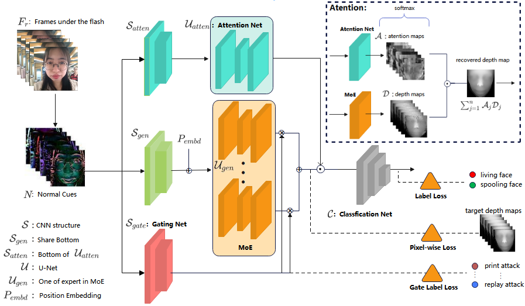
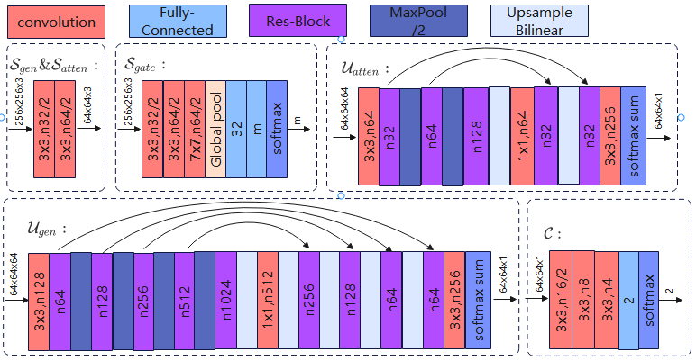

# Mixture-of-Experts Spatial Attention Network for light reflection facial anti-spoofing

## Abstract
​    This paper proposes a Mixture-of-Experts Spatial Attention Network(MoESA) for light reflection face anti-spoofing which is simple yet effective that has already been used by millions of user. Specifically, MoESA first uses a shared-bottom feature-extraction module, and then uses a few end-to-end trainable U-Net as expert modules to estimate the multi-frame facial depth maps, a gating network take the input features and output softmax gates assembling the experts with different weights. Last we uses Spatial Attention to merge there recovered multi-frame depth maps to one,  then sent to a simple classifification structure to distinguish the real 3D face from those 2D presentation attacks. Extensive experiments on our datasets demonstrate the superiority of our proposed method over the state of the arts.

Keywords:Mixture-of-Experts,Spatial Attention,gating network,face anti-spoofing

## 1.Introduction

​    Face anti-spoofing has been more and more applied in our real life.Before face recognition, it is necessary to know whether the captured face is living or spoofing(e.g. printing a face on paper or replaying a face on a digital device). Although specific hardware equipped(e.g., structured light、LIDAR or infrared light) can achieve good classification performance on face anti-spoofing task[[^1],[^2]]，but they rely on the customized hard ware design and increases the system cost. It is a very challenging problem to directly realize the Face anti-spoofing on the mobile devices. 

​    Recent advances on Presentation Attack Detection (PAD) tend to estimate depth directly from a single RGB image. Such methods introduce certain prior by recovering sparse[^3] or dense[[^4],[^5]] depth features,  but the main issue with uses single image is the lack of strong prior of object shapes. 

​    In the past few years, some method using the flash on the mobile phone screen as an auxiliary signal to help estimate depth for face anti-spoofing has emerged[^6]. It can extract the flash information of mobile phone screen from face photos, these flash information called normal cues and will use them as input.  As the 3D shape of different areas of the face is different, different normal cues will be generated from the flash, while for face on printed materials or electronic screens has no 3D shape, the normal cues generated are different from living face.The existing method uses a U-net[^7] structure to estimate depth, and use this depth map to liveness classifiers.
​    Although the previous face anti-spoofing via light reflection has made significant progress，it still suffer from some following problems. First,  frames of different attack instruments (printed materials, electronic screens, etc) have different data distribution,  the inherent conflicts from data distribution can actually harm the predictions, particularly when model parameters are extensively shared among all samples. And then, multi-frames information is often collected for face anti-spoofing in order to improve the accuracy, how to fuse these information to obtain a reliable result is a problem that has not been solved by previous methods.
​    In this paper, we propose a new network named Mixture-of-Experts Spatial Attention Network for light reflection face anti-spoofing. To address the inherent conflicts from data distribution problem of face anti-spoofing task, a few end-to-end trainable U-Net will be used as multi-expert modules, while also having a gating network trained to optimize each expert module. And to address the mixture of multi-frames problem, a spatial attention module also be design to to generate attention maps assembling the recovered multi-frame depth maps with different weights. These improvements to the traditional model have been applied in industrial products and achieved very good results. 
​    Our main contributions are summarized as follows:

* We are the first to use Mixture-of-Experts structure in face anti-spoofing tasks. The input from different attack instruments will use different expert modules to estimate facial depth maps. Each expert module uses the U-net structure, and shared-bottom module had be used to extract low-level features for all the expert moudles.

* A trainable gating network is designed to assemble the experts with different weights，allowing frames of different attack instruments to utilize experts differently.

* Spatial attention module has use to merge recovered multi-frame depth maps. Therefore, the noise in a certain area of a frame will not affect the accuracy of the model.

​    The remainder of this paper is organized as follows. Section 2 reviews the related works. Section 3 and 4 presents our MoESA architecture and its training method, respectively. Experimental results are reported in Section 5. Finally, we provide some concluding remarks in Section 6.

## 2.Relate work

### 2.1 Depth supervised Methods for Face Anti-spoofing

​	Depth supervised methods had achieved great success in the face anti-spoofing task. In [^6], they first use tools(e.g., PRNet[^8]) to  generate depth maps for input images before the training stage,  the sample of living face will estimate these depth map, but the fake face sample will estimate a gray map because their depth values in different areas are the same, then use the recovered depth map for liveness classifiers. However, the authors only use one U-Net module to estimate depth, the inherent conflicts from samples from different attack (e.g., print attack, replay attack and so on) can actually harm the predictions, particularly when model parameters are extensively shared among all samples. We also found that there is often a lot of noise in the input data during the the light quality inspection,  and these noises will affect the estimation of the depth map.

### 2.2 Mixture of Experts && MMoE
​	Ensemble models and ensemble of subnetworks have been proven to be able to improve model performance in DNNs[[^9], [^10]]. Some method using the mixture-of-experts model as MoE layer and stack them in a DNN[[^11], [^12]],  the MoE layer selects subnets (experts) based on the input of the layer at both training time and serving time. MMoE[^13] uses gating networks take the input features and output softmax gates assembling the experts with different weights to deal with multi-tasks learning. We took inspiration from these works by using an ensemble of subnets (experts) to estimate depth and use a gating networks to assembling the recovered depth maps, but we will forbit the gate network learning automatically, because in face anti-spoofing task, which expert is good at which attack instrument  can be prompt.

### 2.3 Attention Learning in Deep Networks

​	Attention improves the performance by encouraging the model to focus on the most relevant parts of the input[^14].  Previous method propose a visual attention model  that is capable of extracting information from an image or video by adaptively selecting a sequence of regions or locations and only processing the selected regions at a high resolution[^15]. Spatial attention module is proposed to learn 'where' to attend in spatial axes[^16]. We took inspiration from these works, we used spatial attention module to merge multi-frames informetion to one, and the noise in the multi-frames will be significantly reduced.

## 3.The Proposed Method

​    In this section, we will first introduce the methods for obtaining multi-frame normal cues as input data in Section 3.1, then introduce the Mixture-of-Experts Spatial Attention Network(MoESA) in Section 3.2, and at last rethinking the uneven distribution of samples at Section 3.3.

 **Figure 1:Mixture-of-Experts Spatial Attention Network.**We uses a few end-to-end trainable U-Net as expect module to estimate the facial depth maps and deal with different attack instruments.Spatial Attention will merge recovered multi-frame depth maps  to one-frame.  

### 3.1.Multi-Frame Normal Cues 

​    We let the mobile phone screen flash in different colors and collect frames under the flash. Given the facial reflection frames $F_r$. We adopt affine transformation to align facial reflection frames,with transformation matrix estimated from the facial landmarks detected by PRNet[^8].
$$
F_r=K_r+L_r
$$
Where $K_r$ is the influence of ambient light on $F_r$, and $L_r$ is the influence of mobile phone screen flash on $F_r$.

 **Figure 2:Normal Cues.**. $F_r$ denotes the facial reflection frames. First of the $F_r$ is a facial reflection frame taken under white flash, and last is taken under black flash. $N$ denotes Normal Cues  

​    Assume the ambient light is unchanged, normal cues between defferenct $F_r$ can be considered as the reflection of mobile phone screen flash on the face surface without influence of ambient light.

$$
N=
\begin{bmatrix}1 & -1 & 0 & 0 & 0 \\ 0 & 1 & 0 & 0 & -1 \\ 1 & 0 & -1 & 0 & 0 \\ 0 & 0 & 1 & 0 & -1 \\ 1 & 0 & 0 & -1 & 0 \\ 0 & 0 & 0 & 1 & -1 \\  \end{bmatrix}
\begin{bmatrix}L_{r_1} \\ L_{r_2} \\ L_{r_3} \\ L_{r_4} \\ L_{r_5} \end{bmatrix}
=
\begin{bmatrix}1 & -1 & 0 & 0 & 0 \\ 0 & 1 & 0 & 0 & -1 \\ 1 & 0 & -1 & 0 & 0 \\ 0 & 0 & 1 & 0 & -1 \\ 1 & 0 & 0 & -1 & 0 \\ 0 & 0 & 0 & 1 & -1 \\  \end{bmatrix}
\begin{bmatrix}F_{r_1} \\ F_{r_2} \\ F_{r_3} \\ F_{r_4} \\ F_{r_5} \end{bmatrix}
$$
Normal cues will be normalize at last. **Fig. 2** illustrates the method of obtaining multi-frame normal cues. 

### 3.2.Mixture-of-Experts Spatial Attention Network

​    We generated depth maps for $F_r$, and uses end-to-end trainable U-Net to regress these facial depth maps, so the model will understand facial partitions information from input in high-level features, but low-level features still can't know what area the current pixel belongs to, so position embeddings are added to the feature maps directy to retain positional information. After doing so, we found that the model converges faster and the accuracy is improved. 

​    Multi-experts modules has be used to deal with frames from different attack instruments, For example, the first expert module will study the difference between living face frames and printed matter face frames, the second will study the difference between living face frames and electronic screens face fames, and so on. 

​    Each expert module will generate depth map frames, so we used a trainable gate module to mixture all of the experts.For example, if normal cues look like printed matter face, the gate of the first expert module will predict 1 and will choose the first expert module to generate depth map frames.

   We found depth map frames that we predict has different quality in different areas, so we uses Spatial Attention module to merge multi-frams to one frame. At last, uses a top classification module to classify this depth map frame.The detailed structure is shown in **Fig. 2**.

​    There are $n$ expert modules in our network, after obtaining $m$ frames of normal cues  $N_1$,$N_2$,...,$N_m$ of one video.First, we will generate multi-frame depth maps:

$$
\begin{aligned}
{Depth_{reg}}_i=\sum_{j=1}^n\mathcal{U}_{gen}^j(\mathcal{S_{gen}}(N_i)+P_{embd})*\mathcal{S_{gate}}(N_i)^j
\end{aligned}
$$

​    Where $\mathcal{S_{gen}}$ denotes stem operation that contains two convolutional layers, $P_{embd}$ denotes position embedding of different facial partitions  that have been aligned, $\mathcal{U}_{gen}^j$ denotes the depth recover net of $expert_j$, $\mathcal{S_{gate}}$ denotes the gate value predict net of all the expert modules.

​    And then,we will generate multi-frame spatial attention maps to merge multi-frame depth maps to one frame:
$$
\begin{aligned}
{Atten_{reg}}_i=\frac{ e^{\mathcal{U}_{atten}(\mathcal{S_{atten}}(N_i))} }{\sum_{{i'}=1}^{m}e^{\mathcal{U}_{atten}(\mathcal{S_{atten}}(N_{i'}))}}
\end{aligned}
$$
​    Where  $\mathcal{S_{atten}}$ denotes stem operation that contains two convolutional layers,   $\mathcal{U}_{atten}$ denotes the spatial attention net.

​    At last，we will uses the One-frame depth map we generated to face anti-spoofing classify.
$$
\begin{aligned}
Pred=\mathcal{C}(\sum_{i=1}^{m}{Depth_{reg}}_i*{Atten_{reg}}_i)
\end{aligned}
$$
​    Where $\mathcal{C}$ denotes the classfication module.  

​    The classifier has the following loss function:
$$
\begin{aligned}
\mathcal{L_{cls}}=-(1-\lambda_{depth}-\lambda_{gate})(clog(Pred)+(1-c)(1-log(Pred)))\\

\begin{aligned}
+\lambda_{depth}\sum_{p\in\mathbb{Z}^2}-\mathcal{k}\log(\frac{e^{d_k(p)}}{\sum_{{k'}=1}^{256}e^{d_{k'}(p)}})
\end{aligned}
\\

\begin{aligned}
+\lambda_{gate}\sum_{j=1}^n-g_j\frac{e^{\mathcal{S_{gate}}(N_i)^j}}{\sum_{{j'}=1}^ne^{\mathcal{S_{gate}}(N_i)^{j'}}}
\end{aligned}

\end{aligned}
$$

​     Where  $\lambda_{depth}$ is the weight of the depth estimation loss and $\lambda_{gate}$ is the weight of the gate value estimation loss.In depth recovering part, we adopt 2D pixel-wise soft-max over the predicted depth map combined with the cross-entropy loss function, where $k$ :  $\Omega\rightarrow 1, ..., 256$ is the ground truth depth label, $d_k(p)$ is the feature map of  activation on channel $k$ at the pixel position $p$, while the feature map activation ${Depth_{reg}}_i$ is the output of the depth recover net.In gate vale learning part, $g_j=1$ if we really know $N_i$ belongs to $expert_j$, otherwise $g_j=0$, For example, $expert_1$ is printed materials face expert, $expert_2$ is electronic screens face expert.If $N$ is printed materials face, then $g_1=1$ and $g_2=0$, if $N$ is living face, then $g_1=0$ and $g_2=0$.

### 3.3.Uneven distribution of hard and easy samples

 **Figure 3:Hard and Easy Samples.**. Easy Living Face and Easy Spoofing Face case are easy to distinguish, Hard Living Face and Hard Spoofing Face case are hard to distinguish.  

​    We found that most samples in our dataset are well classified, call them easy case.Due to the change of ambient light or the flicker of electronic screen, we will encounter attack samples that are difficult to classify in a few cases, call them hard case. It is difficult for the model to learn how to distinguish hard cases because the number is too less. So we first trained a weak model to mark hard case and easy case, then enlarge the sampling proportion of hard case, last we trained a strong model, and found that the classification ability of the model will be significantly improved. The detailed case and recovered depth maps of them is shown in **Fig. 3**.

## 4.Experiments
### 4.1 Implementation Details

#### Depth Generation

​	Dense face alignment PRNet [^8] is adopted to estimate the 3D shape of the living face and
generate the facial depth map with size 64 × 64. More details and samples can be found in [^18]. To distinguish living faces from spoofing faces, at the training stage, we normalize living depth map in a range of [0, 1] and then calculate the square of the pixel value  to improve the discrimination, while setting spoofing depth map to 0.5. We found that the depth map generated by these changes will perform better in classification than the previous method[[^6],[^18]]. 

#### Model Training

​	We use Pytorch to implement out method and initialize all convolutional and fully-connected layers with normal weight distribution[^17]. . For optimization solver, we adopt RMSprop[^18], during training process. Training our network roughly takes 8 hours using a single NVIDIA Tesla V100 GPU and iterates for ∼64 epochs.
#### Evaluation Criteria

​	We use common criteria to evaluate the anti-spoofifing performance, including False Rejection Rate ($FRR$), False Acceptance Rate ($FAR$) and Half Total Error Rate ($HTER$),which depends on the threshold value $\tau_{cls}$. To be specifific, $FRR$ and $FAR$ are monotonic increasing and decreasing functions of τcls, respectively. A more strict classifification criterion corresponds to a larger threshold of $\tau_{cls}$, which means spoof faces are less likely to be misclassifified. For certain data set $\mathbb{T}$ and $\tau_{cls}$, $HTER$ is defifined by
$$
HTER(\tau_{cls},\mathbb{T})=\frac{FRR(\tau_{cls}, \mathbb{T})+FAR(\tau_{cls}, \mathbb{T})}{2}\in(0,1).
$$
Lower $HTER$ means better average performance on liveness classification, and $HTER$ reaches its minimum when $FAR=FRR$, which is defined as Equal Error Rate ($EER$).

 **Table 1:**. Comparisons of $EER$ from development set and $HTER$ from testing set in our dataset for different model structures.  

此处是假数据，先占位置，等真实模型训练出库后改
| Model Structure | Base          | MoE           | Spatial Attention | MoESA         |
| --------------- | ------------- | ------------- | ----------------- | ------------- |
| $EER$(%)        | 2.31$\pm$0.23 | 1.48$\pm$0.21 | 2.31$\pm$0.23     | 2.31$\pm$0.23 |
| $HTER$(%)       | 3.53$\pm$0.43 | 2.09$\pm$0.33 | 2.09$\pm$0.33     | 2.09$\pm$0.33 |

下图是假的，等对比模型出库后再实现

 **Figure 4:.**. Comparisons on depth recovery between MoE and MoESA.  

### 4.2 Ablation Study

#### Effectiveness of distinguish living faces from spoofing faces
​	First, we conduct experiments to demonstrate the effects of the different model structure. To be specifific,  we use the same parameters and dataset to train 4 different models, and then evaluate the mean and standard variance of $EER$ and $HTER$, as show in **Tab.1**. The performance improves gradually, which verifies its effectiveness to distinguish living faces from spoofing faces.

#### Depth Recovery base on Spacial Attention

​	Our system uses Spacial Attention to denoise the depth maps and merge multi-frames depth maps to one. We verified the effect of spatial attention through experiments, as show in **Figure 4**.  Special attention can select the regions with the best quality from multi-frames and fuse them together,  the noise on the depth map will be significantly reduced.

### 4.3 Comparison to Methods

#### Depth Map Estimation

​	Next, we conduct comparisons on depth recovery against the recent AG method[^6], also as shown in Fig. 4. We see that our method can recover more accurate depth map on various aspects, such as pose, facial contour and organ details,  and noise is less then AG method. It can demonstrate the effects of our methord to recover depth. 

 **Table 2:**. Comparisons of $EER$ from development set and $HTER$ from testing set in our dataset for different methords.  

| Method                   | $EER$(%) | $HTER$(%) |
| ------------------------ | -------- | --------- |
| SURF[^19]                | 4.72     | 14.65     |
| Deep LBP[^20]            | 5.61     | 8.83      |
| FASNet[^21]              | 5.67     | 8.60      |
| Auxiliary Depth CNN[^22] | 2.55     | 5.36      |
| AG[^6]                   | 1.24     | 1.91      |
| Ours                     | xxx      | xxx       |

#### Face Anti-Spoofifing 

​	Here, we conduct comparisons on anti-spoofifing, in which our method and several AG methods are trained and tested on our dataset.   We can't conduct tests on public datasets because there are no flash information. After training, we determine the threshold $\tau_{cls}$ via the $EER$ on the develop set and evaluate the $HTER$ on the test set.  **Tab. 2** shows that our method signifificantly outperforms the prior methods. 

## 5.Conclusion
​	In this paper,  an effective light reflection facial anti-spoofing network is proposed. The key novelty of our method is the combination of  Mixture-of-Experts and Special Attention, which significantly improve the accuracy and reliability of anti-spoofing system against unlimited 2D presentation attacks. Extensive experiments on public benchmark and our dataset show that MoESA is superior to the state of the art methods.

## References

[^1]: Lei Li, Xiaoyi Feng, Zinelabidine Boulkenafet, Zhaoqiang Xia, Ming-ming Li, and Abdenour Hadid. An original face anti-spoofing approach using partial convolutional neural network. In International Conference on Image Processing Theory Tools and Applications (IPTA), 2016.
[^2]: Lei Li, Xiaoyi Feng, Xiaoyue Jiang, Zhaoqiang Xia, and Abdenour Hadid. Face anti-spoofing via deep local binary patterns. In IEEE International Conference on Image Processing (ICIP), 2017.
[^3]: Tao Wang, Jianwei Yang, Zhen Lei, Shengcai Liao, and Stan Z Li. Face liveness detection using 3d structure recovered from a single camera. In Proceedings of International Conference on Biometrics (ICB), 2013.
[^4]: Yousef Atoum, Yaojie Liu, Amin Jourabloo, and Xiaoming Liu. Face anti-spoofing using patch and depth-based cnns. In IEEE International Joint Conference on Biometrics (IJCB), 2017.
[^5]: Yaojie Liu, Amin Jourabloo, and Xiaoming Liu. Learning deep models for face anti-spoofifing: Binary or auxiliary supervision. In Proceedings of the IEEE Conference on Computer Vision and Pattern Recognition (CVPR), 2018.
[^6]: Yao Liu, Ying Tai, and Jilin Li. Aurora Guard: Real-Time Face Anti-Spoofing via Light Reflection. In 出处以后补
[^7]: O. Ronneberger, P. Fischer, T. Brox, U-net: Convolutional networks for 630 biomedical image segmentation, in: International Conference on Medical image computing and computer-assisted intervention, 2015, pp. 234–241.
[^8]: Yao Feng, Fan Wu, Xiaohu Shao, Yanfeng Wang, and Xi Zhou. Joint 3d face reconstruction and dense alignment with position map regression network. In Proceedings of European Conference on Computer Vision (ECCV), 2018.
[^9]: R Caruna. 1993. Multitask learning: A knowledge-based source of inductive bias. In Machine Learning: Proceedings of the Tenth International Conference. 41–48.
[^10]: Geoffrey Hinton, Oriol Vinyals, and Jeff Dean. 2015. Distilling the knowledge in a neural network. arXiv preprint arXiv:1503.02531 (2015).
[^11]: David Eigen, Marc’Aurelio Ranzato, and Ilya Sutskever. 2013. Learning factored representations in a deep mixture of experts. arXiv preprint arXiv:1312.4314 (2013).
[^12]: Noam Shazeer, Azalia Mirhoseini, Krzysztof Maziarz, Andy Davis, Quoc Le, Geoffrey Hinton, and Jeff Dean. 2017. Outrageously large neural networks: The sparsely-gated mixture-of-experts layer. arXiv preprint arXiv:1701.06538 (2017).
[^13]: Jiaqi Ma, Zhe Zhao, Xinyang Yi. Modeling Task Relationships in Multi-task Learning with Multi-gate Mixture-of-Experts 出处以后补
[^14]: Minh-Thang Luong, Quoc V Le, Ilya Sutskever, Oriol Vinyals, and Lukasz Kaiser. 2015. Multi-task sequence to sequence learning. arXiv preprint arXiv:1511.06114 (2015).
[^15]: V. Mnih, N. Heess, A. Graves et al., “Recurrent models of visual attention,” in Advances in neural information processing systems, 2014, pp. 2204–2212
[^16]: Sanghyun Woo, Jongchan Park, Joon-Young Lee. CBAM: Convolutional Block Attention Module 出处以后补
[^17]: Kaiming He, Xiangyu Zhang, Shaoqing Ren, and Jian Sun. Delving deep into rectifiers: Surpassing human-level performance on imagenet classification. In Proceedings of the IEEE International Conference on Computer Vision (ICCV), 2015.
[^18]: Zezheng Wang, Chenxu Zhao, Yunxiao Qin, Qiusheng Zhou, and Zhen Lei. Exploiting temporal and depth information for multi-frame face anti-spoofing. arXiv preprint arXiv:1811.05118, 2018.
[^19]: Zinelabidine Boulkenafet, Jukka Komulainen, and Abdenour Hadid. Face antispoofing using speeded-up robust features and fisher vector encoding. IEEE Signal Processing Letters, 24(2):141–145, 2017.
[^20]: Lei Li, Xiaoyi Feng, Xiaoyue Jiang, Zhaoqiang Xia, and Abdenour Hadid. Face anti-spoofing via deep local binary patterns. In IEEE International Conference on Image Processing (ICIP), 2017.
[^21]: Oeslle Lucena, Amadeu Junior, Vitor Moia, Roberto Souza, Eduardo Valle, and Roberto Lotufo. Transfer learning using convolutional neural networks for face anti-spoofing. In Proceedings of International Conference Image Analysis and Recognition (ICIAR), 2017.
[^22]: Yaojie Liu, Amin Jourabloo, and Xiaoming Liu. Learning deep models for face anti-spoofing: Binary or auxiliary supervision. In Proceedings of the IEEE Conference on Computer Vision and Pattern Recognition (CVPR), 2018.